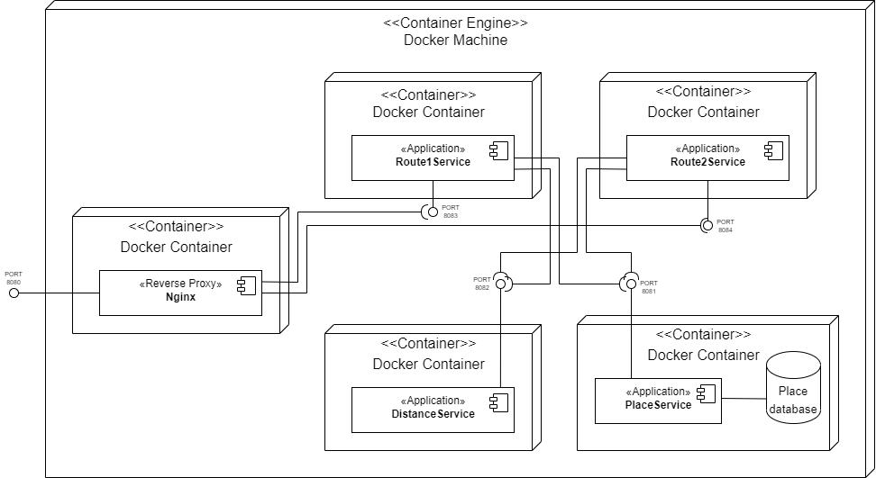
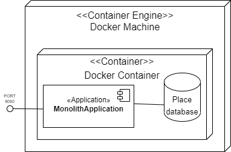
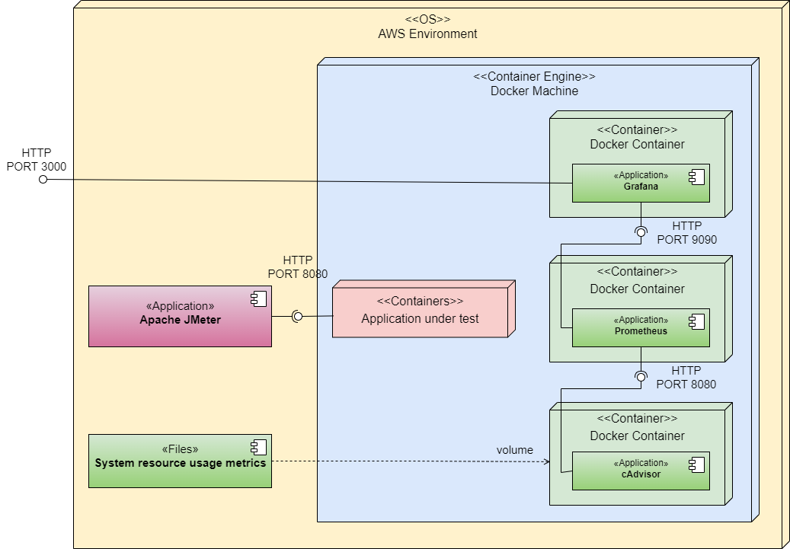

[](https://github.com/rogowski-piotr/system-benchmarking-monolith-vs-microservices/blob/piotr-create-documentation-for-application/LICENSE.md)
[](https://github.com/rogowski-piotr/system-benchmarking-monolith-vs-microservices/actions/workflows/test.yml?query=branch%3Amain)


# Benchmark of software architecture


## Table of content
* [General Information](#general-information)
* [Used Technologies](#used-technologies)
* [Aplications architecture overview](#aplications-architecture-overview)
* [Infrastructure Overview](#infrastructure-overview)
* [Benchmark Overview](#benchmark-overview)
* [Start Guide](#start-guide)
* [About Authors](#about-authors)


## General Information
This is an implementation of a complete benchmarking application. It is adapted to compare the performance and scalability of applications depending on the used technology and software architecture.

Each of the applications being the subject of research offers service for the traveling salesman algorithm implemented in two different versions. Each of them is based on a different computational and memory complexity. The input data for each application are cities in Poland correlated with their coordinates. Currently, the applications have been implemented in several technologies:
 <table>
  <tr>
    <th>Programming Language</th>
    <th>Framework</th>
  </tr>
  <tr>
    <td>Java</td>
    <td>Spring Boot</td>
  </tr>
  <tr>
    <td>C#</td>
    <td>.NET</td>
  </tr>
  <tr>
    <td>Python</td>
    <td>Flask</td>
  </tr>
</table>

Each of the technologies was implemented using two different software architectures - monolith and microservices. During the process of their implementation a big pressure was put to use the same logic for each application. Also, each application was containerized using Docker.

Benchmark generates an even load on the application and collects data about resource consumption and response times. The application has been designed to conduct tests in the cloud environment using the AWS platform. Appropriate tools were used to automate the benchmark launch process and all processes were divided into separate stages:
 * Preparing cloud environment (set type of instance, etc.)
 * Configure environment (install dependent software and tools)
 * Launch benchmark (run application and collect data)

Monitoring of application has been implemented in a way that allows to review dedicated metrics in the form of static charts after the benchmark ends. There is also a possibility to observe metrics in real time using the Graphana tool.

## Used Technologies

### Applications:
 * Python3 and Flask framework
 * Java 17 and Spring Boot framework
 * C# and .NET framework
 * Docker and docker-compose to containerize each applications
 * Nginx as reverse proxy for microservices

### Infrastructure:

### Aplication load:

### Postprocessing:

## Aplications architecture overview
The <b>microservice architecture</b> consists of five components. One of them is Reverse Proxy and the other are applications written in a specific programming language. Microservices communicate with each other via the HTTP protocol. Each of service has a different responsibility:
 * Place Service - Provide information about places and them coordinates
 * Distance Service - Calculate spherical distance between passed points
 * Route1 Service - Solve TSP problem using nearest neighbour algorithm
 * Route2 Service - Solve TSP problem by checking all variants
 
<p align="center">
    
</p>

The <b>monolith architecture</b> contains one component. All the necessary functionalities are implemented as part of this component. All communication between the implemented functionalities works with internal references in the code of a programming language.

<p align="center">
    
</p>

## Infrastructure overview

## Benchmark overview

To run benchmark requires to prepare an environment using configuration scripts or use appropriate workflow. Environment should have all necessary dependendent software and properly configured monitoring environment. if the environment is properly configured, just run this script:
```shell script
./script/run_benchmark.sh [-f <string> (required)] [-c <true|false> (optional)]
```
The <b>-f</b> parameter determines name of docker-compose file on which the benchmark should be carried out.

The <b>-c</b> parameter determines whether the cleaning step should be performed after the benchmark process.

The benchmark process is based on several steps:
 * <b>Setup</b> step runs the application on which the benchmark will be performed
 * <b>Benchmark</b> step runs the load on the application
 * <b>Collecting data</b> step collects and saves obtained data
 * <b>cleaning</b> step closes the application and clears the obtained data at prometheus

 Diagram below shows the complete infrastructure used to run the benchmark. Whole benchmark process is adapted to use it on AWS platform. At docker is running monitoring infrastructure (Grafana, Prometheus, cAdvisor) and application being under benchmark process. Application workload runs natively on the host operating system (JMeter).

<p align="center">
    
</p>

## Start Guide

## About Authors
This project is a part of the "Projekt Badawczy" program performed by students of Computer Science master degree studies at GUT.