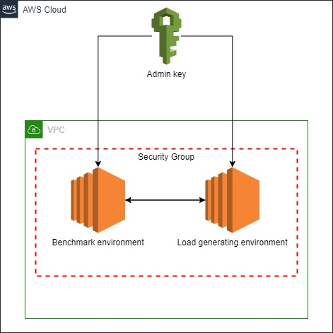
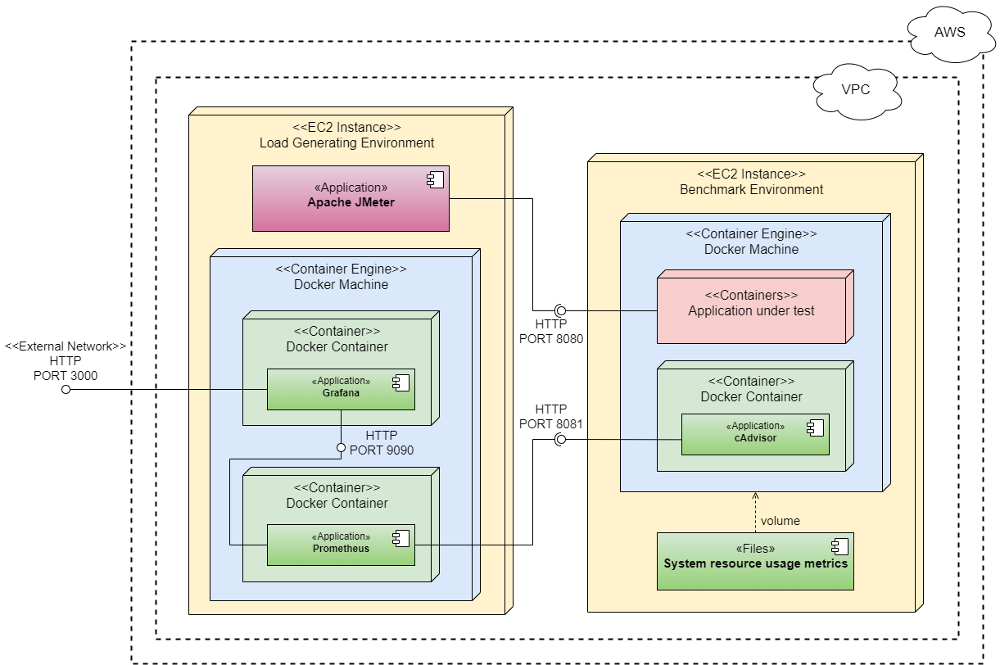

[](https://github.com/rogowski-piotr/system-benchmarking-monolith-vs-microservices/blob/piotr-create-documentation-for-application/LICENSE.md)
[](https://github.com/rogowski-piotr/system-benchmarking-monolith-vs-microservices/actions/workflows/test.yml?query=branch%3Amain)


# Benchmark of software architecture


## Table of content
* [General Information](#general-information)
* [Used Technologies](#used-technologies)
* [Aplications architecture overview](#aplications-architecture-overview)
* [Infrastructure Overview](#infrastructure-overview)
* [Benchmark Overview](#benchmark-overview)
* [Start Guide](#start-guide)
* [About Authors](#about-authors)


## General Information
This is an implementation of a complete benchmarking application. It is adapted to compare the performance and scalability of applications depending on the used technology and software architecture.

Each application have been implemented in several technologies and integrated with tools that allow you to generate a load and collect metrics. More details are available in the [Used Technologies](#used-technologies) section.

Each of the applications being the subject of research offers service for the traveling salesman algorithm implemented in two different versions. Each of them is based on a different computational and memory complexity. The input data for each application are cities in Poland correlated with their coordinates. Each of the technologies was implemented using two different software architectures - monolith and microservices. During the process of their implementation a big pressure was put to use the same logic for each application. More details about application architecture available in the section [Aplications architecture overview](#aplications-architecture-overview).

Benchmark generates an even load on the application and collects data about resource consumption and response times. The application has been designed to conduct tests in the cloud environment using the AWS platform. Appropriate tools were used to automate the benchmark launch process and all processes were divided into separate stages. The details about the benchmark process are available in the sections [Infrastructure Overview](#infrastructure-overview) and [Benchmark Overview](#benchmark-overview).

Monitoring of application has been implemented in a way that allows to review dedicated metrics in the form of static charts after the benchmark ends. There is also a possibility to observe metrics in real time using the Graphana tool.


## Used Technologies


### Applications:
<table>
  <tr>
    <th>Programming Language</th>
    <th>Framework</th>
  </tr>
  <tr>
    <td>Java</td>
    <td>Spring Boot</td>
  </tr>
  <tr>
    <td>C#</td>
    <td>.NET</td>
  </tr>
  <tr>
    <td>Python</td>
    <td>Flask</td>
  </tr>
</table>

 * Docker and docker-compose to containerize each applications
 * Nginx as reverse proxy and load balancer for microservices


### Infrastructure:
The <b>AWS</b> cloud was chosen as the environment for the application.
The applications run on EC2 which is a virtual machine running the Linux operating system, with the size and performance depending on needs (to be selected during the launch of the workflow called <a href="https://github.com/rogowski-piotr/system-benchmarking-monolith-vs-microservices/actions/workflows/run_terraform.yml"><i>Preparing the cloud environment</i></a>)

<b>Terraform and Ansible</b> were used to create the entire infrastructure. 
 * Terraform is responsible for AWS configuration i.e. creating a virtual machine, creating a security group, selecting a key to connect via SSH, setting up a provider along with the region where machine is to be located, creating a VPC and using the Terraform cloud, it eliminates the need for unnecessary tooling and documentation for teams to use Terraform in production.
 * Ansible is responsible for properly configuring the server. Installing all the dependencies, running all the necessary services and scripts, and granting the appropriate permissions.


### Aplication load:
* To generate the load we use the JMeter tool that allows parameterization of load generation using multiple threads.
* The load generation process is embedded in a separate environment to do not disturb measurement process of resource consumption by the real application being the object under test.


### Monitoring
* A set of technologies was used to monitor resource consumption by the application: CAdvisor, Prometheus and Grafana. Thanks to this, it is possible to view the collected metrics in real time via connecting to Grafana tool available on port 3000.


### Postprocessing:

* R programming language - generating static charts


## Aplications architecture overview
The <b>microservice architecture</b> consists of five components. One of them is Reverse Proxy and the other are applications written in a specific programming language. Microservices communicate with each other via the HTTP protocol. Each of service has a different responsibility:
 * Place Service - Provide information about places and them coordinates
 * Distance Service - Calculate spherical distance between passed points
 * Route1 Service - Solve TSP problem using nearest neighbour algorithm
 * Route2 Service - Solve TSP problem by checking all variants
 
<p align="center">
    
</p>

The <b>monolith architecture</b> contains one component. All the necessary functionalities are implemented as part of this component. All communication between the implemented functionalities works with internal references in the code of a programming language.

<p align="center">
    
</p>

## Infrastructure overview
<p align="center">
    
</p>

## Benchmark overview
To run benchmark requires to prepare an environment using configuration scripts or use appropriate workflow. Environment should have all necessary dependendent software and properly configured monitoring environment. if the environment is properly configured, just run this script:
```shell script
./script/run_benchmark.sh [-f <string> (required)] [-l <string> (required)] [-b <string> (required)]
```
The <b>-f</b> parameter determines name of docker-compose file on which the benchmark should be carried out.
The <b>-l</b> parameter determines address of load generating host.
The <b>-b</b> parameter determines address of benchmark host.

The benchmark process is based on several steps:
 * <b>Setup</b> step runs the application on which the benchmark will be performed
 * <b>Benchmark</b> step runs the load on the application
 * <b>Collecting data</b> step collects and saves obtained data
 * <b>cleaning</b> step closes the application and clears the obtained data at prometheus

 Diagram below shows the complete infrastructure used to run the benchmark. Whole benchmark process is adapted to use it on AWS platform. At docker is running monitoring infrastructure (Grafana, Prometheus, cAdvisor) and application being under benchmark process. Application workload runs natively on the host operating system (JMeter).
 
 The load is generated from an independent environment (Load Generating Environment) on the AWS EC2 platform, to don't disrupt resource use by the environment under test (Benchmark Environment).

<p align="center">
    
</p>


## Start Guide


### Steps to create the infrastructure
<ol>
  <li>
    <a href="https://portal.aws.amazon.com/gp/aws/developer/registration/index.html?nc2=h_ct&src=header_signup">Creating an AWS account</a>
      <ul>
        <li>Create an IAM account named <b><i>admin</i></b> and add it to the group <b><i>Administrators</i></b></li>
        <li>Create an IAM account named <b><i>terrafom</i></b> and add it to the group <b><i>Administrators</i></b></li>
        <li>Generate a key for the admin account and save it as <b><i>admin.pem</i></b></li>
      </ul>
    <a href="https://docs.aws.amazon.com/IAM/latest/UserGuide/getting-started_create-admin-group.html">Detailed instruction</a>
  </li>
  <li>Move the generated key to the system-benchmarking-monolith-vs-microservices/infrastructure/ssh_key folder</li>
  <li>Encrypt the key with gpg</li> 
    <p><code>gpg --symmetric --cipher-algo AES256 admin.pem</code></p>
    <p><i>Thanks to the fact that an entry admin.pem was added to gitignore, the key will not be added to the remote repository, it will only appear in the local one</i></p>
  <li>
      <a href="https://app.terraform.io/public/signup/account?product_intent=terraform">Creating an Terraform cloud account</a>     
    <ul>
      <li>Name your organization <b><i>Projekt-badawczy</i></b></li>
      <li>Create workspace <b><i>gh-actions</i></b> </li>
    </ul>
    <a href="https://learn.hashicorp.com/tutorials/terraform/github-actions">Detailed instruction</a>
  </li>

  <li>
    Github secrets should be set as follows
    <ul>
      <li><b>TF_API_TOKEN</b> - Terraform cloud API</li>
      <li><b>EC2_SSH_KEY</b> - Unencrypted content of admin.pem key</li>
      <li><b>BENCHMARK_DNS</b> - Public IPv4 DNS adress of a benchmark environment server</li>
      <li><b>LOAD_GENERATING_DNS</b> - Public IPv4 DNS adress of a load generating environment server </li>
      <li><b>PASSWORD</b>  - password used to encrypt admin.pem key with gpg</li>
    </ul>
  </li>
  <li>
  <a href="https://github.com/rogowski-piotr/system-benchmarking-monolith-vs-microservices/actions">Github actions</a>
  <p>Building the entire infrastructure is done automatically using workflows. They have been numbered from 1 to 4, respectively, according to the order in which they should be run.</p>
  <ul>
    <li><a href="https://github.com/rogowski-piotr/system-benchmarking-monolith-vs-microservices/actions/workflows/run_terraform.yml">Preparing cloud environment </a> is responsible for running the terraform code, that is, building the entire infrastructure in AWS</li>
    <li><a href="https://github.com/rogowski-piotr/system-benchmarking-monolith-vs-microservices/actions/workflows/benchmark_server_configuration.yml">Benchmark server configuration </a> is responsible for running the ansible code, installing the appropriate dependencies and software i.e. cAdvisor and configuring the benchmark server </li>
    <li><a href="https://github.com/rogowski-piotr/system-benchmarking-monolith-vs-microservices/actions/workflows/load_generating_server_configuration.yml">Load generating server configuration </a> is responsible for running the ansible code, installing the appropriate dependencies and software i.e.JMeter, Grafana, Prometheus and configuring the load generating server </li>
    <li><a href="https://github.com/rogowski-piotr/system-benchmarking-monolith-vs-microservices/actions/workflows/run_benchmarks.yml">Run benchmarks </a> simply runs benchmarks</li>
  </ul>
  </li>
</ol>

### Steps to run benchmark in cloud environment
To start benchmark process and prepare cloud environment dedicated github workflows have been prepared:
 
1. <b>Prepare cloud environment</b> prepare cloud environment on AWS platform using Terraform
2. <b>Configure benchmark server</b> prepare all dependencies on benchmark environment using Ansible
3. <b>Configure load generating server</b> prepare all dependencies on load generating environment using Ansible
4. <b>Run benchmark</b> run benchmark process and collect data

All related results with single run available at Run benchmark run history as workflow artifact.

### Steps to run benchmark in local environment
To start benchmark in local environment run this script:
```shell script
bash scripts/local-env/run_benchmark.sh -f <docker-compose file>
```

## About Authors
This project is a part of the "Projekt Badawczy" program performed by students of Computer Science master degree studies at GUT.